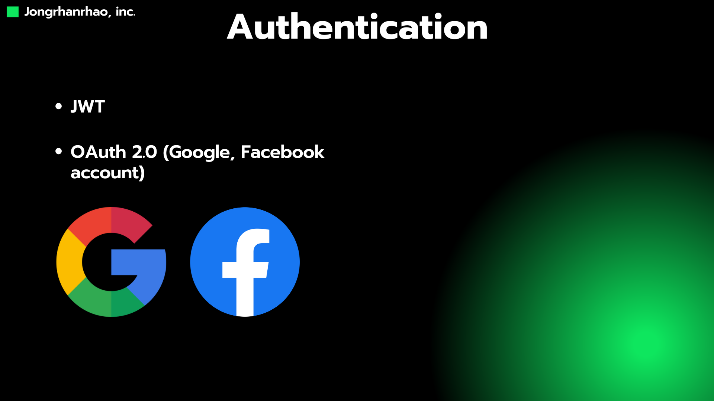
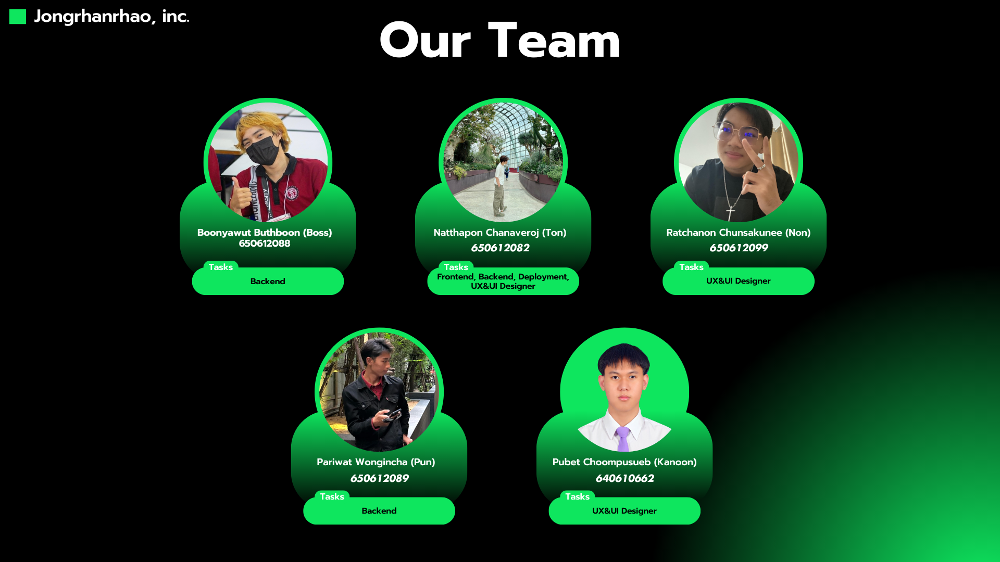
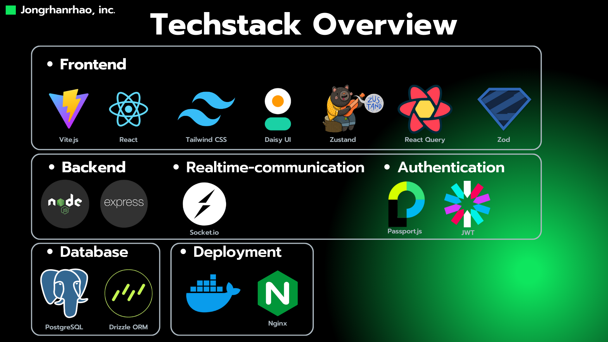
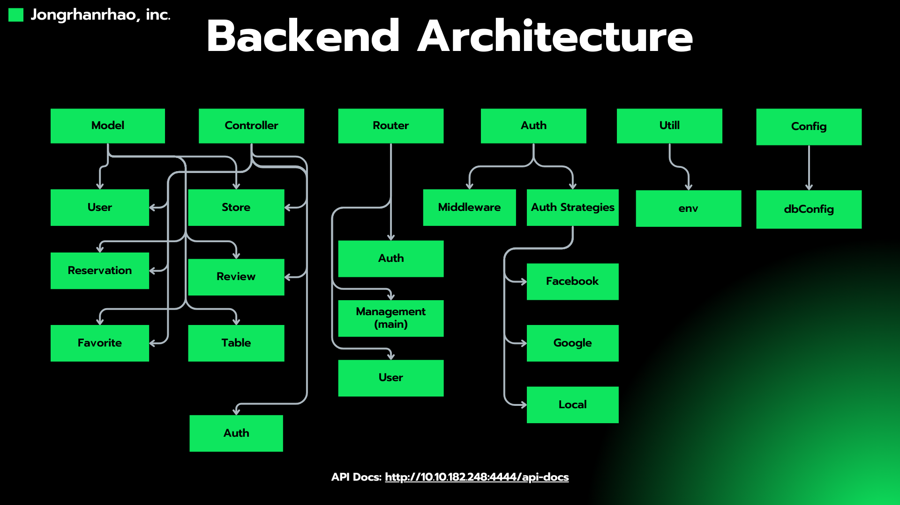
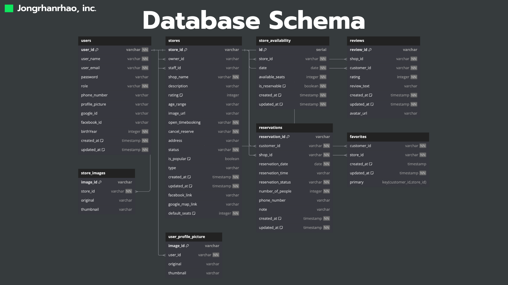
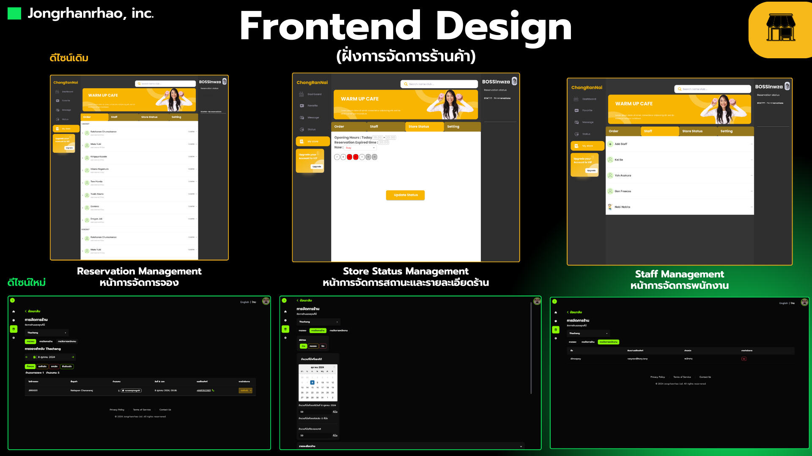

## 🎯 **Project Overview**
The Jongrhanrhao project is a full-stack web application showcasing advanced features such as authentication, real-time communication, and database management. It integrates modern technologies for both frontend and backend to deliver a seamless user experience.

---

## 🧑‍💻 **Team Members** 

| Name                      | ID         | Role                  |
|---------------------------|------------|-----------------------|
| Boonyawut Buthboon (Boss) | 650612088  | Backend               |
| Natthapon Chanaveroj (Ton)| 650612082  | Frontend, Backend, Deployment, UX/UI Designer |
| Ratchanon Chunsakunee (Non)| 650612099 | UX/UI Designer        |
| Pariwat Wongnicha (Pun)   | 650612089  | Backend               |
| Pubet Choompsueb (Kanoon) | 640610662  | UX/UI Designer        |

---

## 🚀 **Techstack Overview**

| **Category**              | **Technologies**                                       |
|---------------------------|-------------------------------------------------------|
| **Frontend**              | Vite, React, Tailwind CSS, DaisyUI, Zustand, React Query, Zod |
| **Backend**               | Node.js, Express.js                                    |
| **Realtime Communication**| Socket.io                                             |
| **Authentication**        | Passport.js, JWT                                      |
| **Database**              | PostgreSQL, Drizzle ORM                                |
| **Deployment**            | Docker, Nginx                                         |

---

## 🏗️ **Backend Architecture**
The backend architecture is modular and organized into the following components:

- **Model**: User, Store, Reservation, Review, Favorite, Table.
- **Controller**: Manages the business logic for each model.
- **Router**: Handles HTTP routing for endpoints.
- **Auth**: Implements authentication strategies (Google, Facebook, Local).
- **Utils**: Environment configurations and utility functions.
- **Config**: Database configuration and connection management.

---

## 🗂️ **Database Schema**

The database schema is designed to handle various entities efficiently. Major tables include:

- **Users**: Stores user information such as name, email, role, and authentication IDs.
- **Stores**: Handles store details, descriptions, and availability.
- **Reservations**: Tracks user reservations with status and timestamps.
- **Reviews**: Manages customer reviews with ratings.
- **Favorites**: Tracks users' favorite stores.

---

## 🔐 **Authentication**

The application supports the following authentication methods:

- **JWT**: Secure token-based authentication.
- **OAuth 2.0**: Integration with Google and Facebook for user login.

---

## 🛡️ **Security Considerations**
To ensure a secure and robust application, the following measures are implemented:

- **Input Validation**: Protects against SQL injection and XSS attacks.
- **Password Hashing**: Ensures secure storage of user passwords.
- **Helmet**: Adds HTTP headers for enhanced security.
- **CORS**: Restricts cross-origin requests.
- **Rate Limiting**: Prevents brute force attacks.
- **Sanitization**: Cleans input data to prevent injection attacks.
- **HPP Protection**: Prevents HTTP parameter pollution.

---

## 🌟 **Highlights and Screenshots**

### **1. Team Overview**

### **2. Techstack** 

### **3. Backend Architecture**

### **4. Database Schema**

 ### **5. FrontEnd Design** 
 <!--   -->

 <!--   -->
 --- 

 ### **Project Code** 
 [JongRhanRhao](https://github.com/JongRhanRhao) 

## 📝 **Conclusion**
The Jongrhanrhao project demonstrates the integration of modern full-stack technologies to build a scalable and efficient web application. Its modular backend, dynamic frontend, and robust security features make it a strong foundation for future developments. 
