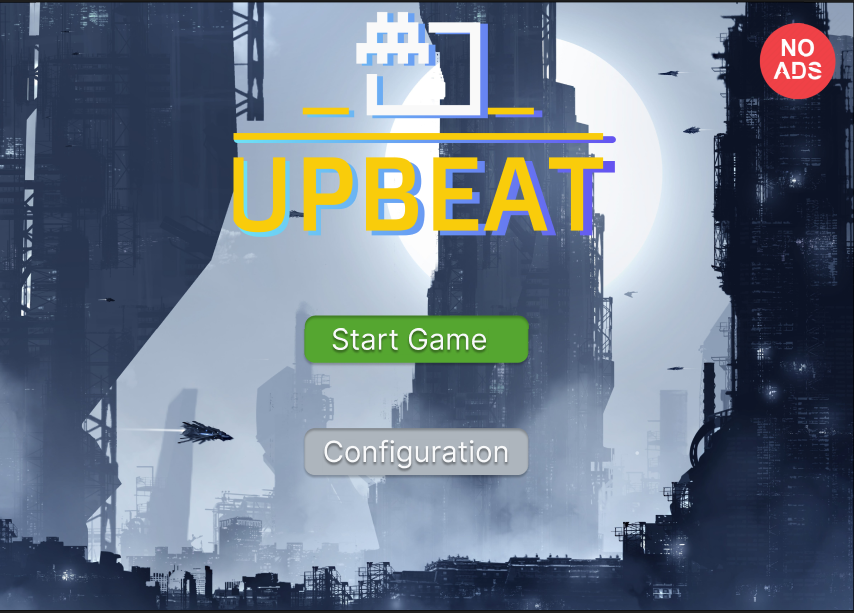
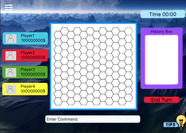
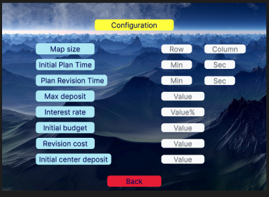

---

## 🎮 Project Overview

**UPBEAT Game** is a turn-based strategy game where players manage resources, invest in territories, and compete to win. The system is developed using **Java** for the backend and **HTML/CSS** for the frontend design.

---

## 🔧 Technologies Used

| **Component**       | **Technologies**              |
|---------------------|------------------------------|
| **Backend**         | Java (OOP, Parser AST)       |
| **Frontend**        | HTML, CSS                    |
| **Testing**         | JUnit 5                      |
| **Build Tools**     | Maven                        |
| **Version Control** | Git & GitHub                 |

---

## 👥 Team Members

- **นายบุญญวุฒิ บุตรบุญ** (650612088)  
- **นายพุฒิพงศ์ กุนาง** (650612095)  
- **นายธีรภัทร์ ลำตาล** (650610772)

---

## 🛠️ Features

### **1. Dynamic Map Generation**
- Map size is defined in the `config.txt` file (e.g., `m x n` dimensions).
- Map data is stored in the `Region` class with attributes such as:
  - **Position**: `m` (row), `n` (column)
  - **Deposit**: `deposit`
  - **Owner**: `Player`
  - **Interest**: `interest`

### **2. Player Actions**
Players input commands through a **Parser** that generates an Abstract Syntax Tree (AST) for command processing:

| **Command** | **Description**                  |
|-------------|----------------------------------|
| `move`      | Move in a specified direction    |
| `invest`    | Invest in a territory            |
| `collect`   | Collect returns from investments |
| `attack`    | Attack opponent’s territory     |
| `done`      | End the player’s turn           |

### **3. Interest Calculation**
Interest is calculated using the following formula:
$$
\text{interest} = \text{base interest rate} \times \log_{10}(\text{deposit}) \times \ln(\text{turn})
$$
This encourages strategic planning for investment and resource management.

### **4. Frontend User Interface**
- **Menu Screen**: Main menu
- **Gameplay Screen**: Displays game state and map
- **Config Screen**: Adjust map size and game parameters

---

## 🧪 Testing

### **1. Configuration Test**
Tests reading parameters from the `config.txt` file:
```java
@Test
public void testReadConfiguration() {
    Configuration config = Configuration.instance();
    assertEquals(5, config.m);
    assertEquals(5, config.n);
    assertEquals(10000, config.init_budget);
}
```

### **2. Player Move Test**
Tests the `move` command for a player:
```java
@Test
public void testPlayerMove() {
    Player player = new Player(1);
    player.setX(2);
    player.setY(2);
    player.move("up");  
    assertEquals(1, player.getX());
    assertEquals(2, player.getY());
}
```

---

## 📸 Screenshots

### **1. Menu Screen**


### **2. Gameplay Screen**


### **3. Config Screen**


---

## 🚀 How to Run the Project

### **Backend Setup**

1. Clone the project from GitHub:
```bash
git clone https://github.com/SCKagura/OOP-Project-Group-16.git
cd OOP-Project-Group-16
```

2. Build and run the project:
```bash
mvn clean install
java -jar target/UPBEATGame.jar
```

### **Frontend Setup**
Open the `index.html` file in a web browser and ensure the connection to the backend is established.

---

## 🎯 Challenges and Solutions

### **1. Frontend-Backend Connection**
**Challenge**: Integrating API for game data exchange between frontend and backend.  
**Solution**: Designed RESTful APIs to handle player commands and game states.

### **2. Parser Logic**
**Challenge**: Supporting complex commands through AST.
**Solution**: Implemented an Abstract Syntax Tree (AST) for efficient command parsing and execution.

---

## 🔮 Future Improvements

1. Integrate the frontend and backend through APIs.
2. Add an AI opponent for single-player mode.
3. Develop a multiplayer mode for multiple players.
4. Enhance UI/UX with interactive JavaScript features.

---

## 📄 Project Paper
[Final Project Report (PDF)](/src/assets/Files/UPBEAT/Final_Project_Report_UPBEAT.pdf)

---

## 🔗 GitHub Repository
[GitHub Repo](https://github.com/SCKagura/OOP-Project-Group-16.git)

---

## 👨‍💻 Contributing
Interested in contributing? Fork the repository and create a pull request or report issues via GitHub Issues.

---

## 📝 Conclusion
The UPBEAT Game project showcases a clear system design leveraging OOP principles and a flexible structure. It is prepared for future feature enhancements in both backend and frontend, making this project robust and ready for scalability.
